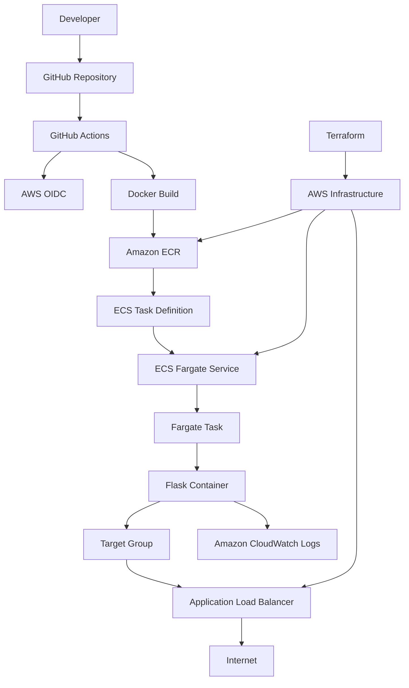

# AWS DevOps Engineer Demo

A containerized Python Flask application deployed on AWS using Docker, Amazon ECR, Amazon ECS Fargate, Application Load Balancer, Terraform, AWS IAM, Amazon CloudWatch, and GitHub Actions.

---

## Project Overview

This project demonstrates an end-to-end DevOps workflow for deploying a containerized application on AWS.

The project includes:

- Python Flask application
- Docker containerization
- Amazon ECR for container image storage
- Amazon ECS Fargate for running containers
- Application Load Balancer for public access
- Terraform for Infrastructure as Code
- AWS IAM for access control
- GitHub Actions for CI/CD
- GitHub OIDC for secure AWS authentication
- Amazon CloudWatch for container logging
- ALB health checks and ECS service monitoring

---

## Architecture



### Application Request Flow

```text
Internet
   |
   v
Application Load Balancer :80
   |
   v
Target Group :5000
   |
   v
ECS Fargate Service
   |
   v
Fargate Task
   |
   v
Flask Container :5000
```

### CI/CD Flow

```text
Developer
   |
   | git push
   v
GitHub
   |
   v
GitHub Actions
   |
   +--> AWS OIDC Authentication
   |
   +--> Docker Build
   |
   +--> Push Image to ECR
   |
   +--> Render ECS Task Definition
   |
   +--> Deploy ECS Service
   |
   v
ECS Fargate
   |
   v
Updated Application
```

---

## Technology Stack

| Technology | Purpose |
|---|---|
| Python | Application development |
| Flask | Web application framework |
| Docker | Containerization |
| Amazon ECR | Docker image storage |
| Amazon ECS | Container orchestration |
| AWS Fargate | Serverless container compute |
| Application Load Balancer | Public HTTP traffic routing |
| Terraform | Infrastructure as Code |
| AWS IAM | Access control |
| GitHub Actions | CI/CD automation |
| GitHub OIDC | Secure AWS authentication |
| Amazon CloudWatch | Container log management |

---

## Repository Structure

```text
aws-devops-demo/
│
├── app/
│   ├── app.py
│   ├── Dockerfile
│   └── requirements.txt
│
├── iac/
│   ├── main.tf
│   ├── providers.tf
│   ├── variables.tf
│   ├── outputs.tf
│   └── github-actions.tf
│
├── pipeline/
│   └── task-definition.json
│
├── .github/
│   └── workflows/
│       └── deploy.yml
│
├── .gitignore
└── README.md
```

---

# Application

The application is a simple Python Flask API.

## Endpoints

### Home

```text
GET /
```

Example response:

```json
{
  "message": "AWS DevOps Demo Application",
  "status": "running",
  "version": "1.0.0"
}
```

### Health Check

```text
GET /health
```

Example response:

```json
{
  "status": "healthy"
}
```

The `/health` endpoint is also used by the Application Load Balancer as the target health check.

---

# Docker

The Dockerfile is located inside the `app/` directory.

## Dockerfile

The application uses a lightweight Python image and exposes port `5000`.

## Build the image

From the project root:

```bash
docker build -t aws-devops-demo ./app
```

## Run locally

```bash
docker run --rm -p 5000:5000 aws-devops-demo
```

Test the application:

```bash
curl http://localhost:5000/
```

Test the health endpoint:

```bash
curl http://localhost:5000/health
```

---

# Amazon ECR

Amazon Elastic Container Registry is used to store the Docker image.

Repository:

```text
aws-devops-demo
```

Example repository URL:

```text
<ACCOUNT_ID>.dkr.ecr.ap-south-1.amazonaws.com/aws-devops-demo
```

ECR image scanning is enabled when images are pushed.

## Authenticate Docker with ECR

```bash
aws ecr get-login-password --region ap-south-1 | \
docker login --username AWS --password-stdin \
<ACCOUNT_ID>.dkr.ecr.ap-south-1.amazonaws.com
```

## Tag the image

```bash
docker tag aws-devops-demo:latest \
<ACCOUNT_ID>.dkr.ecr.ap-south-1.amazonaws.com/aws-devops-demo:latest
```

## Push the image

```bash
docker push \
<ACCOUNT_ID>.dkr.ecr.ap-south-1.amazonaws.com/aws-devops-demo:latest
```

## Verify images

```bash
aws ecr list-images \
  --repository-name aws-devops-demo \
  --region ap-south-1 \
  --output table
```

---

# AWS Infrastructure

Terraform provisions the AWS infrastructure required for the application.

## Networking

The project creates:

- VPC
- Public subnet
- Second public subnet in another Availability Zone
- Private subnet
- Internet Gateway
- Public route table
- Route table associations

### VPC

```text
CIDR: 16.0.0.0/16
Region: ap-south-1
```

### Public Subnets

```text
Public Subnet 1
CIDR: 16.0.1.0/24
Availability Zone: ap-south-1b

Public Subnet 2
CIDR: 16.0.3.0/24
Availability Zone: ap-south-1a
```

### Private Subnet

```text
CIDR: 16.0.2.0/24
```

The two public subnets are used by the Application Load Balancer.

---

# Security Groups

## ALB Security Group

The ALB security group allows HTTP traffic:

```text
Inbound:
TCP 80 from 0.0.0.0/0
```

Outbound traffic is allowed for the demo.

## ECS Security Group

The ECS security group allows Flask traffic only from the ALB security group:

```text
Inbound:
TCP 5000 from ALB Security Group
```

This prevents direct application traffic from the internet from reaching the ECS container on port `5000`.

---

# Application Load Balancer

The Application Load Balancer provides public access to the Flask application.

## ALB

```text
Type: Application Load Balancer
Scheme: Internet-facing
Listener: HTTP :80
```

## Target Group

```text
Protocol: HTTP
Port: 5000
Target Type: IP
Health Check: /health
```

## Health Check

The ALB checks:

```text
GET /health
```

Expected response:

```json
{
  "status": "healthy"
}
```

---

# Amazon ECS Fargate

Amazon ECS is used to manage the container workload.

AWS Fargate provides the compute used to run the ECS container without managing EC2 servers.

## ECS Cluster

```text
aws-devops-demo-cluster
```

## Task Definition

The task definition describes how the container should run.

```text
Launch Type: FARGATE
CPU: 256
Memory: 512 MB
Network Mode: awsvpc
Container Name: python-app
Container Port: 5000
```

The container image is stored in Amazon ECR.

## ECS Service

```text
Service:
aws-devops-demo-service

Desired Tasks:
1
```

The ECS service maintains the desired number of running tasks and connects the task to the Application Load Balancer target group.

---

# CloudWatch Logging

Container logs are sent to Amazon CloudWatch Logs.

Log group:

```text
/ecs/aws-devops-demo
```

The ECS task uses the AWS logs driver.

## View logs

```bash
aws logs tail /ecs/aws-devops-demo \
  --since 30m \
  --region ap-south-1
```

CloudWatch can be used to investigate:

- Application startup
- Container output
- Application errors
- ECS deployment behavior

---

# Terraform

Terraform is used to provision and manage the AWS infrastructure.

Terraform files are located in:

```text
iac/
```

## Terraform Files

### `providers.tf`

Configures Terraform and the AWS provider.

### `variables.tf`

Contains Terraform variables such as the AWS region.

### `main.tf`

Contains the main AWS infrastructure resources including:

- VPC
- Subnets
- Internet Gateway
- Route table
- Security groups
- ECR
- IAM
- ALB
- Target group
- ECS

### `outputs.tf`

Provides useful deployment values such as:

- ECR repository URL
- ALB DNS name
- ECS execution role ARN

### `github-actions.tf`

Creates:

- GitHub OIDC provider
- GitHub Actions IAM role
- GitHub Actions IAM policy

---

# Terraform Deployment

Go to the Terraform directory:

```bash
cd iac
```

## Initialize Terraform

```bash
terraform init
```

## Format Terraform files

```bash
terraform fmt
```

## Validate configuration

```bash
terraform validate
```

## Review changes

```bash
terraform plan
```

## Apply infrastructure

```bash
terraform apply
```

## View managed resources

```bash
terraform state list
```

## Inspect a specific resource

Example:

```bash
terraform state show aws_ecs_service.app
```

Example:

```bash
terraform state show aws_lb.app
```

## Display outputs

```bash
terraform output
```

Get only the ALB DNS name:

```bash
terraform output -raw alb_dns_name
```

---

# GitHub Actions CI/CD

The GitHub Actions workflow is located at:

```text
.github/workflows/deploy.yml
```

A push to the `main` branch triggers the deployment pipeline.

## Pipeline Stages

```text
1. Checkout source code
2. Authenticate to AWS using GitHub OIDC
3. Login to Amazon ECR
4. Build Docker image
5. Push Docker image to ECR
6. Render ECS task definition
7. Deploy new ECS task definition
8. Wait for ECS service stability
```

## CI/CD Workflow

```text
git push
   |
   v
GitHub Actions
   |
   v
AWS OIDC
   |
   v
Temporary AWS credentials
   |
   v
Docker build
   |
   v
Amazon ECR
   |
   v
ECS task definition
   |
   v
ECS Fargate deployment
```

---

# GitHub OIDC Authentication

GitHub Actions uses OpenID Connect to authenticate with AWS.

The project creates:

```text
GitHub OIDC Provider
        |
        v
GitHub Actions IAM Role
        |
        v
Temporary AWS Credentials
```

No long-lived AWS access keys are stored in the GitHub repository.

The IAM trust policy is restricted to the project repository and the `main` branch.

---

# CI/CD Image Versioning

The GitHub Actions workflow uses the Git commit SHA as the Docker image tag.

Example:

```text
aws-devops-demo:<commit-sha>
```

This means each deployment gets a unique image version.

Example:

```text
Commit A → Image A
Commit B → Image B
Commit C → Image C
```

This makes deployments easier to identify and provides a better basis for rollback than using only the `latest` tag.

---

# CI/CD Demonstration

To demonstrate the pipeline:

1. Modify the Flask application.
2. Commit the change.
3. Push to `main`.
4. GitHub Actions automatically starts.
5. A new Docker image is built.
6. The image is pushed to ECR.
7. ECS receives a new task definition revision.
8. ECS deploys the new task.
9. The ALB serves the updated application.

Example:

```bash
git add .
git commit -m "Update application"
git push origin main
```

Then open:

```text
GitHub → Repository → Actions
```

and select:

```text
Deploy to AWS ECS
```

---

# Testing

## Check ECS Service

```bash
aws ecs describe-services \
  --cluster aws-devops-demo-cluster \
  --services aws-devops-demo-service \
  --region ap-south-1 \
  --query 'services[0].[status,runningCount,desiredCount]' \
  --output table
```

Expected:

```text
ACTIVE    1    1
```

## Check ECS Tasks

```bash
aws ecs list-tasks \
  --cluster aws-devops-demo-cluster \
  --service-name aws-devops-demo-service \
  --region ap-south-1
```

## Check ALB Target Health

```bash
aws elbv2 describe-target-health \
  --target-group-arn "$(aws elbv2 describe-target-groups \
    --names aws-devops-demo-tg \
    --region ap-south-1 \
    --query 'TargetGroups[0].TargetGroupArn' \
    --output text)" \
  --region ap-south-1 \
  --query 'TargetHealthDescriptions[*].[Target.Id,TargetHealth.State]' \
  --output table
```

Expected:

```text
healthy
```

---

# Test the Application

Get the ALB DNS name:

```bash
terraform output -raw alb_dns_name
```

Open:

```text
http://<ALB-DNS-NAME>/
```

Expected response:

```json
{
  "message": "AWS DevOps Demo Application",
  "status": "running",
  "version": "1.0.0"
}
```

Health endpoint:

```text
http://<ALB-DNS-NAME>/health
```

Expected:

```json
{
  "status": "healthy"
}
```

---

# Security

The project uses several basic security practices:

- GitHub Actions uses OIDC instead of long-lived AWS access keys
- IAM roles are used for AWS permissions
- ECS traffic on port 5000 is restricted to the ALB security group
- ECR image scanning is enabled
- Terraform state files are excluded from Git
- AWS credentials are not stored in the source code
- GitHub Actions deployment permissions are separated through a dedicated IAM role

---

# Git and GitHub

## Check repository status

```bash
git status
```

## Add changes

```bash
git add .
```

## Commit

```bash
git commit -m "Update project"
```

## Push

```bash
git push origin main
```

---

# `.gitignore`

Terraform state and generated files should not be committed.

The project excludes:

```text
.terraform/
*.tfstate
*.tfstate.*
*.tfvars
*.tfvars.json
```

Never commit:

- AWS access keys
- AWS secret keys
- Passwords
- API tokens
- `.env` files
- Terraform state files containing sensitive information

---

# Project Validation Checklist

```text
Application
[ x ] Flask application works
[ x ] /health endpoint works

Docker
[ x ] Docker image builds
[ x ] Container runs locally

ECR
[ x ] Repository created
[ x ] Docker image pushed
[ x ] Image scanning enabled

Terraform
[ x ] Infrastructure provisioned
[ x ] VPC created
[ x ] Subnets created
[ x ] Security groups created
[ x ] ALB created

ECS
[ x ] ECS cluster created
[ x ] Task definition created
[ x ] Fargate service created
[ x ] Task running

Load Balancer
[ x ] Target group created
[ x ] ALB listener created
[ x ] Target healthy
[ x ] Application accessible through ALB

CI/CD
[ x ] GitHub Actions workflow created
[ x ] AWS OIDC configured
[ x ] Docker build automated
[ x ] ECR push automated
[ x ] ECS deployment automated

Monitoring
[ x ] CloudWatch log group created
[ x ] ECS container logging configured
```

---

# Current AWS Region

```text
ap-south-1
```

AWS Region:

```text
Asia Pacific (Mumbai)
```

---

# Cleanup

AWS resources can generate charges while they are running.

To remove the Terraform-managed infrastructure:

```bash
cd iac
terraform destroy
```

Review the destroy plan carefully and confirm only when you are sure the resources can be deleted.

After cleanup, verify that the AWS resources are no longer needed.

---

# Final Result

This project demonstrates a complete AWS DevOps deployment:

```text
                 GitHub
                    |
                    v
             GitHub Actions
                    |
             AWS OIDC Auth
                    |
                    v
             Docker Build
                    |
                    v
                  ECR
                    |
                    v
           ECS Task Definition
                    |
                    v
             ECS Fargate
                    |
                    v
              Flask Task
                    |
                    v
             Target Group
                    |
                    v
                 ALB
                    |
                    v
                Internet

          Flask Logs
               |
               v
          CloudWatch
```

The project combines:

```text
Infrastructure as Code
        +
Containerization
        +
AWS Container Deployment
        +
Load Balancing
        +
CI/CD Automation
        +
IAM / OIDC Security
        +
CloudWatch Logging
```

---

## Author

**Shiva Jala Prasad**

GitHub:

https://github.com/shiva-jala-21

LinkedIn:

https://www.linkedin.com/in/shivajala
